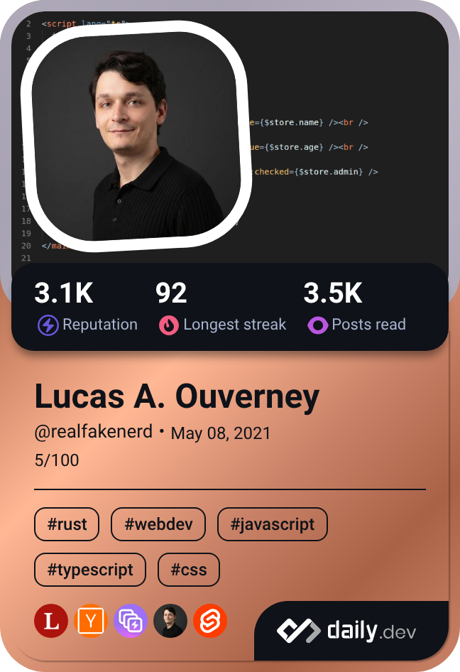

# Lucas (Luke) Ouverney

**Software Engineer** with 7+ years of experience specializing in web environments, reactive frontend architecture, and developer tooling across **TypeScript**, **Svelte 5**, and **Rust**.

---

### 💡 About Me
- 🔭 **Current Focus**: Market intelligence data tools, web scraping architectures, and TypeScript/Rust database engines.
- ⚡ **Engineering Strengths**: Web architecture, reactive state management (Svelte 5 / SvelteKit), custom ORMs, and low-level graphics/systems programming.
---

### 🛠️ Tech Stack & Ecosystem

- **Languages**: TypeScript, JavaScript (Node.js & Bun), Rust, Java
- **Frontend**: Svelte 5, SvelteKit, WebGPU, Tailwind CSS
- **Backend & Cloud**: AWS (DynamoDB), REST APIs, Effect.ts
- **Tooling & Environments**: Linux (WSL), Git, WezTerm

---

### 🚀 Featured Open Source Work

- 📦 **[mizzle](https://github.com/realfakenerd/mizzle)**  
  *TypeScript / AWS DynamoDB*  
  A Drizzle-inspired TypeScript ORM for AWS DynamoDB providing type-safe query builders and schema modeling ([Documentation](https://mizzle-docs.vercel.app)).

- 🦀 **[OpenSkyrim](https://github.com/realfakenerd/OpenSkyrim)**  
  *Rust / Bevy / WebGPU*  
  Experimental game engine architecture implemented in Rust using Bevy and Luau scripting.
  
---

### 📖 What I'm Reading

---

### 📬 Connect
[Portfolio](https://dev-lucasouverney.vercel.app/) · [Linkedin](https://linkedin.com/in/devlucasouverney) · [daily.dev](https://daily.dev/realfakenerd)
